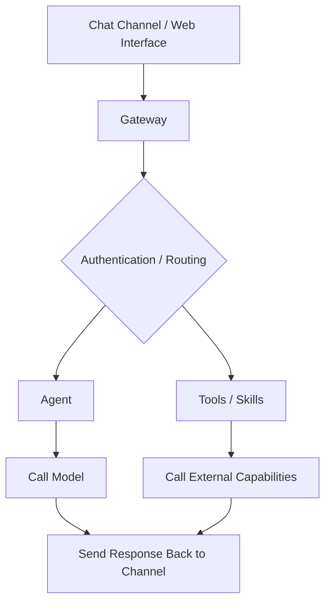

# 1. OpenClaw Overview

This chapter introduces the essentials of **what OpenClaw is, what it is mainly used for, how it differs from LangChain and native SDKs**, and what its overall architecture looks like.

After this chapter, it should be possible to describe OpenClaw in one sentence and understand what the following chapters will cover.

## 1.1 What Is OpenClaw?

OpenClaw can be understood as a **local, self-hosted AI Agent gateway and control console**.

- Set up model API keys for LLMs
- Connect chat channels such as Telegram, WhatsApp or Lark
- Configure different Agents as AI roles
- After receiving a message, OpenClaw routes the request to the corresponding Agent
- The Agent then calls Tools or Skills, generates a response, and sends it back to the channel

In one sentence, **OpenClaw is an engineering platform that connects models, roles, tools, and channels**.

## 1.2 Typical Use Cases

Common OpenClaw use cases, starting from the easiest ones to get running, include the following.

1. Chat assistant for conversations, Q&A, writing, and summarization in Lark or Telegram
2. Multi-role collaboration, such as using `main` as the primary assistant for complex questions and `life` as a lightweight assistant for everyday Q&A
3. Automated notifications, such as scheduled weather updates, announcements, or email summaries
4. Tool-based Agent workflows that can retrieve information, call external APIs, and generate structured output such as `JSON`
5. Enterprise deployment with WeCom or Lark bots for internal knowledge Q&A or workflow assistance

For a minimal first example, later sections of this course cover installation, initialization, and creation of the first Agent from scratch.

## 1.3 How OpenClaw Differs from LangChain and Native SDKs

OpenClaw is often mistaken for just another framework at first. In practice, OpenClaw focuses more on engineering deployment, while LangChain focuses more on chain orchestration.

The comparison below gives a more direct overview.

| Comparison item | LangChain / native SDKs | OpenClaw |
| --- | --- | --- |
| **Goal** | Makes model calls and chains easier to write | Makes it easier to connect Agents to channels and run them in an engineering-ready way |
| **Channel connection** | Usually requires a custom webhook and adapter logic | Provides a Channel and plugin system |
| **Multi-Agent routing** | Requires custom routing logic | Provides concepts such as bindings and Agent lists |
| **Operations support** | Requires custom logging, status tracking, and scheduling | Provides capabilities such as `doctor`, `status`, `logs`, and `cron`, depending on the version |

The key focus in the following chapters is **configuration, running, and debugging**, not only writing a single chain of model-call code.

## 1.4 Overall Architecture Overview

The diagram below shows a simplified version of the architecture.

The key components work as follows.

1. **Gateway** handles running, authentication, and routing.
2. **Agent** is an AI role instance with a workspace, prompts, tools, and skills.
3. **Tools/Skills** enable the Agent to take action instead of only chatting.
4. **Memory** stores context and long-term preferences, usually through files or session mechanisms.
5. **Workflow** connects steps such as fetching, analyzing, and sending into a complete process.
