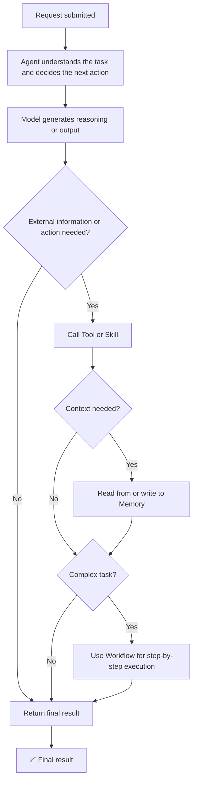

# 2. OpenClaw Core Concepts

**OpenClaw brings models, tools, memory, and workflows together so AI can do more than chat. It can also help complete tasks.**

## 2.1 Model

The **Model** is the AI brain. It is mainly responsible for two things:

- **Understanding**: interpreting the request, intent, and context
- **Generation**: producing answers, steps, or formatted output based on the request

For example, given the prompt `Write a product introduction`, the Model first analyzes the product positioning, target audience, and expected tone, then generates the product copy.

* **A simple way to understand it**

A Model receives a message or a piece of context, processes it, and returns a result.

Different models vary in several common ways:

- Stronger reasoning for complex tasks
- Faster output for frequent daily Q&A
- More fluent writing
- Better coding or structured output for engineering tasks

The best model does not need to be selected at this stage. The key point is that changing the model may affect the output quality, but the Agent and its configuration decide what role the AI plays and how it is used.

* **Role in OpenClaw**

OpenClaw connects models from different providers through a more unified interface whenever possible.

This means the overall project logic does not need to be rewritten every time a different model is used.

In a configuration file, a Model entry usually includes the following information. Field names may vary slightly between versions.

- `provider`: model provider
- `baseUrl`: API endpoint when required
- `apiKey`: private API key
- `model id`: model name or identifier, such as `deepseek-chat`

## 2.2 Agent

**Agent** can be understood as an AI assistant that can carry out tasks.

If the Model is the brain, the Agent is closer to an assistant that can decide what to do next, determine whether a tool is needed, and keep moving the task toward completion.

An Agent does not simply return one reply. It follows the task goal and decides the next action.

* **Common responsibilities**

1. **Understand the request**.
2. **Decide how to handle it**, answering directly for simple tasks or breaking complex tasks into steps.
3. **Decide whether a tool is needed**, such as checking live data when real-time information is required.
4. **Process the returned result**.
5. **Return the final response in a usable form**.

* **Example with weather and umbrella advice**.

Given the request to **check today’s weather in New York and tell me whether an umbrella is needed**, the **Agent** may work like this:

1. Identify that the request includes both weather information and a recommendation.
2. Recognize that weather information must come from an external source instead of guessing.
3. Call a weather tool or skill.
4. Retrieve the weather result, such as precipitation probability and temperature.
5. Turn the result into a clear recommendation.

In short, the Model handles reasoning and generation, while the Agent manages how the task should be carried out.

* **Common behavior styles**

Implementation details may vary by version, but Agent behavior can be roughly viewed as different execution styles:

1. **Think-and-act style**: planning and tool calls happen along the way, with a more continuous output flow.
2. **Plan-then-execute style**: steps are planned first, then executed in order.
3. **Chat-oriented style**: better suited for multi-turn conversations and follow-up questions.

There is no need to memorize these categories. The main point is that an **Agent** focuses on completing a task, not just answering a question.

An **Agent** usually relies on prompts, workspace rules, and tool or skill permissions to decide the next action.

## 2.3 Tool

The **Tool** gives AI the ability to interact with external systems. Even the smartest model can only generate text on its own. To take real action, one needs tools.

* **What tools can do**

Common tool capabilities include:

1. Checking the weather for real-time information
2. Searching the web for reference material
3. Reading files, rules, or documentation
4. Writing files when permission is granted
5. Calling APIs in business systems
6. Performing calculations for more reliable numeric or rule-based results

With tools, AI is no longer limited to producing text. It can also perform actions.

* **Why are tools needed**

For a request such as **What time is it in New York right now?**, relying on the Model alone would be unreliable. In this case, the Agent should:

1. Call a time or timezone tool
2. Get the actual result
3. Format the answer

A simple way to remember the relationship:

1. **Model = the brain**
2. **Tools = the hands**

* **Important note about tools not taking effect**

Not every tool is automatically available to every Agent. Tool access is usually controlled by configuration and permissions, such as whether a tool profile is enabled or whether access is allowed or denied in `tools.allow` and `tools.deny`.

If a tool is not being called, the next step is to check the configuration rather than assume the Model is the problem:

1. Whether the tool is enabled
2. Whether permission allows access
3. Whether the latest configuration has taken effect after restart

* **Key takeaway**

1. Tools reduce reliance on guessing
2. Tools allow AI to access external information or perform actions

## 2.4 Memory

**Memory** allows AI to retain context.

Its purpose is to keep the conversation coherent instead of treating every message as a brand-new interaction.

* **Why memory matters**

Consider this short exchange:

1. “I want to learn Python.”
2. “Is it suitable for beginners?”

Here, “it” refers to Python.

Without memory, the AI may not know what “it” refers to, which can lead to an incomplete or incorrect answer.

* **What Memory can store**

Memory commonly stores:

- Context from recent conversation turns, so references such as “it” remain clear.
- Key information mentioned earlier in the conversation.
- Long-term information that may be reused, such as preferences or commonly used terminology.
- Condensed summaries that save effort later.

Memory can be understood in two common forms:

- **Short-term memory**: recent conversation context, usually tied to the current session.
- **Long-term memory**: information stored more like notes, often in files or long-term records.

* **Why it matters**

With Memory, AI can maintain a continuous exchange instead of starting over with every message.

The key point is simple:

**Memory helps AI keep track of context and preferences.**

## 2.5 Workflow

**Workflow** is the process used to complete a task.

Some tasks cannot be finished in a single step. They need to be broken down and executed in order, which is where a Workflow becomes useful.

* **Workflow example**

For the request “Prepare a sales report,” the actual process may include several steps:

1. Read the data
2. Clean the data
3. Run statistical analysis
4. Generate the final report

This is a typical Workflow.

* **Benefits of a Workflow**

1. **Clearer steps**: each stage of the task is easier to understand.
2. **Lower chance of missing steps**: the process helps prevent skipped or disordered actions.
3. **Better support for complex tasks**: especially when many steps are involved.
4. **Reusable process**: once the workflow is stable, it can be used again for similar tasks.

* **A practical way to understand it**

If the **Agent** acts like the task owner, the **Workflow** acts like the execution plan.

It defines:

1. What happens first
2. What happens next
3. How errors should be handled
4. Whether repetition or branching is required

The main purpose is:

**Workflow = arrange task execution step by step.**

## 2.6 Skills

**Skills** are reusable capability modules.

A Skill packages a common type of functionality in advance, so it can be reused later instead of being assembled from scratch every time.

* **Common Skill capabilities**

Common Skills may include:

1. Document processing, such as reading, summarizing, and extracting key points.
2. Code processing, such as explaining code, suggesting rewrites, and generating implementation ideas.
3. Data analysis, such as calculating statistics and summarizing conclusions.
4. Search, such as retrieving information and returning a summary.
5. Multimodal processing is supported by the environment.

* **Tool vs Skill**

A simple distinction:

1. **Tool** is more like an individual utility.
2. **Skill** is more like a reusable module built from commonly used capabilities.

For example, a document Skill may already include the ability to:

1. Read a document
2. Summarize a document
3. Extract keywords
4. Answer questions based on the document

This avoids rebuilding the same capability from scratch each time.

* **What a Skill usually contains**

A Skill usually includes:

1. `SKILL.md`: metadata for the Model, including the name, trigger scenarios, and input and output descriptions.
2. Code implementation, such as `index.js`, which provides `run(input)`.

A practical way to remember it:

> `SKILL.md` tells the Model when and how to call the Skill. The code defines what actually happens after the Skill is called.

- **Skills = reusable capability modules**
- For custom business capabilities, a Skill is usually the preferred implementation approach.

## 2.7 How These Concepts Work Together

These concepts can be connected as one pipeline:

OpenClaw is not just a single model. It organizes multiple capabilities into a practical AI system that can get work done.

**In essence, OpenClaw connects the AI brain, tools, memory, and workflows so AI can move from conversation to action.**
