# 3. Environment Setup and Installation

> [!NOTE]
>
> **This tutorial uses Ubuntu as the reference environment.**

This chapter sets up the basic environment required to run OpenClaw.

1. Prepare the development environment, with **Node.js** used as the main runtime in this course.
2. Install **OpenClaw**.
3. Configure an **API Key**, or use a local **Ollama** model.
4. Run the first Hello World test.

For Windows systems, **WSL2 with Ubuntu** is the recommended environment for running **OpenClaw**, which helps avoid issues caused by differences between operating systems.

The installation process is built around one core idea. **OpenClaw** is a **self-hosted AI assistant framework**, and its core component is the **Gateway**. The **Gateway** routes messages from different **Channels** to the corresponding **Agent**, while also maintaining the conversation context in the **Session**. By the end of this chapter, the **Gateway** will be running, and the model provider will be configured, allowing the first conversation to return a valid response.

## 3.1 Prerequisites

Prepare the following items before starting.

1. A computer
2. A stable network connection for installation and model calls
3. A text editor, with VS Code recommended
4. Git, optional, for managing custom **Skills** or configuration files

## 3.2 Choosing the Runtime Environment: Python or Node.js

The **OpenClaw** CLI and core runtime are mainly based on the **Node.js** ecosystem. The runtime can be selected based on the setup goal.

- For a basic **OpenClaw** setup, only **Node.js** is required.
- For auxiliary scripts, such as file parsing or report export, **Python** can also be installed.

No coding is required in this chapter, so **Node.js** is sufficient for the basic setup.

## 3.3 Installing Node.js

* **Check the installed version**

If Node.js has already been installed, check the current version first.

```bash
node -v
npm -v
```

<div align="center">
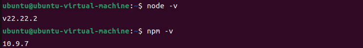
</div>

If the installed version is too old, upgrade with `nvm`.

* **Step 1: Install nvm (Recommended)**

Install `nvm`:

```bash
curl -o- https://raw.githubusercontent.com/nvm-sh/nvm/v0.40.1/install.sh | bash
```

<div align="center">

</div>

Activate the environment variables.

```bash
source ~/.bashrc
```

<div align="center">

</div>

* **Step 2: Install and Use Node 22 or Later**

Install Node 22.

```bash
nvm install 22
```

<div align="center">

</div>

Switch to Node 22.

```bash
nvm use 22
```

<div align="center">
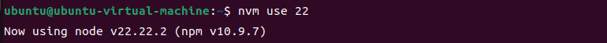
</div>

Set Node 22 as the default version.

```bash
nvm alias default 22
```

<div align="center">
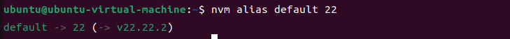
</div>

## 3.4 Installing OpenClaw

Run the following command in **Ubuntu** to install **OpenClaw**.

```bash
npm install -g openclaw@2026.3.24
```

<div align="center">
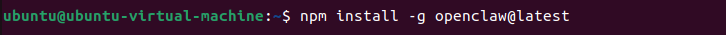
</div>

Check the installed version.

```bash
openclaw --version
```

<div align="center">
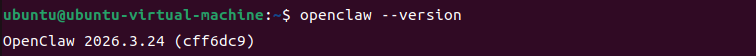
</div>

If the `openclaw` command cannot be found, the `PATH` environment variable is usually not configured correctly. Add the `npm` `bin` directory to `PATH` if needed.

## 3.5 Configuring the API Key

* **Step 1: Run the Onboarding Wizard**

```bash
openclaw onboard
```

<div align="center">
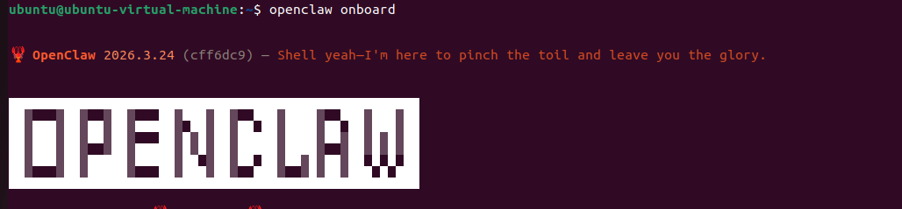
</div>

Select **Yes**.

<div align="center">
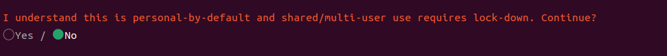
</div>

Click **QuickStart**.

<div align="center">
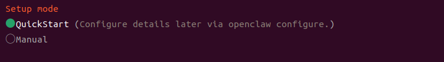
</div>

Click **Reset**.

<div align="center">
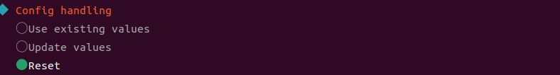
</div>

Click **Config Only** to complete configuration without running the full setup flow.

<div align="center">
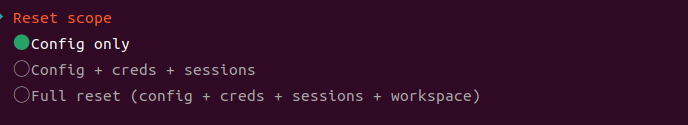
</div>

The following steps use OpenAI as an example. Create an **API Key** on the [OpenAI API Platform](https://platform.openai.com/login) in advance. This key will be used during the OpenClaw model provider setup.

> [!NOTE]
>
> **OpenAI models are accessed through the OpenAI API, which is billed by token usage. Billing must be enabled in the OpenAI account before connecting it to OpenClaw.**

<div align="center">

</div>

Enter the **API Key** generated on the **OpenAI** platform.

<div align="center">
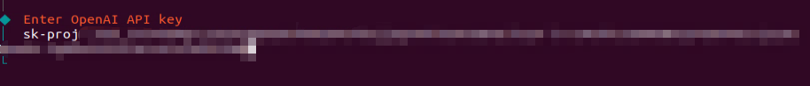
</div>

Select the target model.

<div align="center">

</div>

Skip the message channel setup for now. Channel configuration will be covered later.

<div align="center">
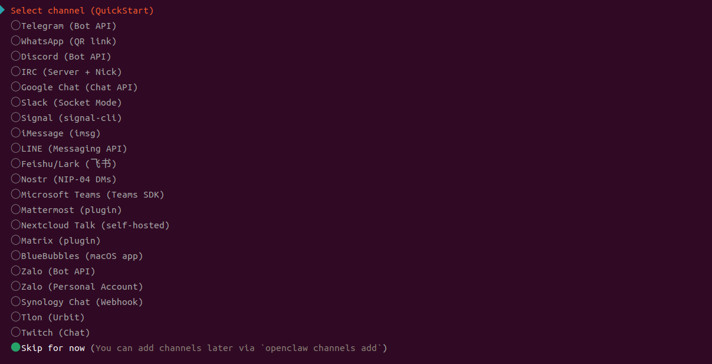
</div>

Leave the **Search provider** unconfigured for now.

<div align="center">
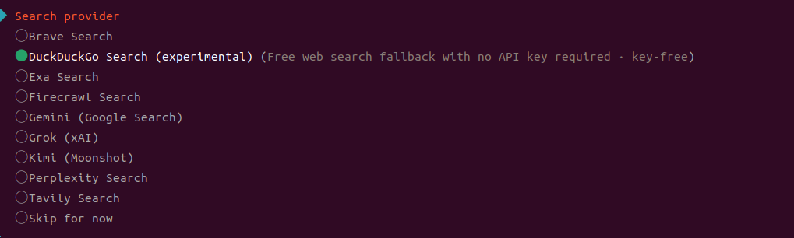
</div>

Skip **Skills** for now. Required **Skills** can be installed later as needed.

<div align="center">
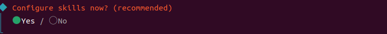
</div>

For hooks, select **Skip for now**, press **Space**, then press **Enter**.

<div align="center">
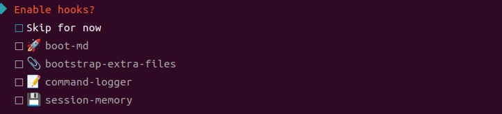
</div>

Select **Restart**, then wait while the **Gateway** is installed and started.

<div align="center">
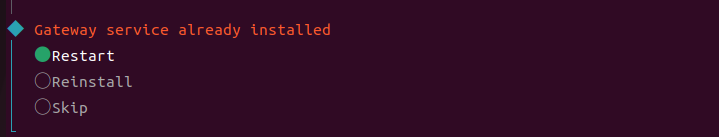
</div>

<div align="center">
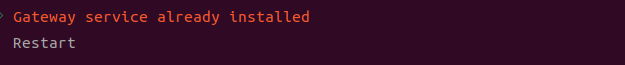
</div>

Either the TUI interface or the Web UI can be used. This section uses TUI as the example.

<div align="center">
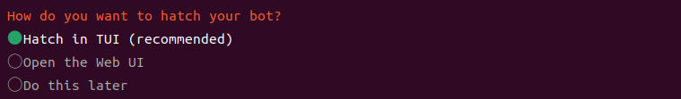
</div>

<div align="center">
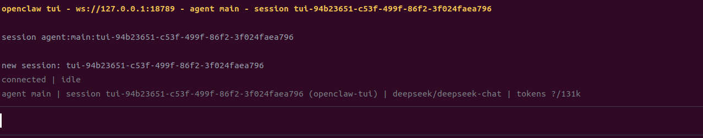
</div>

The basic **OpenClaw** configuration is now complete.

> [!NOTE]
>
> * **After the wizard is complete, `~/.openclaw/` is usually created in the home directory, with `openclaw.json` inside.**
>
> * **Before editing `openclaw.json`, create a backup copy if needed. For example, `openclaw.json.bak`.**

## 3.6 Local Ollama Setup (Optional)

A local large model can be used instead of a cloud API Key.

1. Install Ollama.

```bash
curl -fsSL https://ollama.com/install.sh | sh
```

<div align="center">
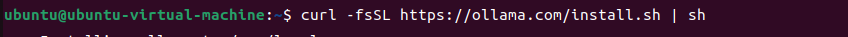
</div>

2. Pull the required model, such as a Llama model. Use the actual model name required by the setup.

```bash
ollama pull llama3.2
```

<div align="center">
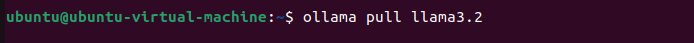
</div>

3. Start Ollama locally.

```bash
ollama run llama3.2
```

<div align="center">
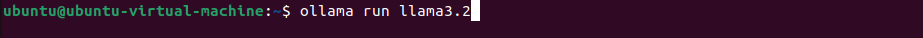
</div>

4. In the **OpenClaw** wizard, select **local** or **Ollama** as the model provider if the option is available.

Configuration fields may vary slightly between **OpenClaw** versions. Use the options shown in the `openclaw onboard` interface as the reference.

## 3.7 Running the First Hello World Test

* **Step 1: Start the Gateway**

```bash
openclaw gateway start
```

<div align="center">
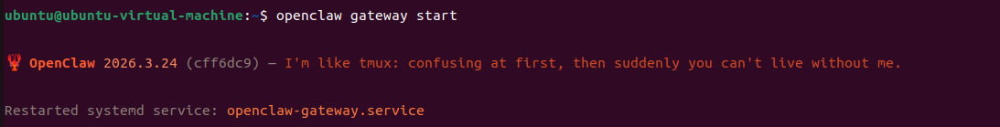
</div>

* **Step 2: Send a Message to the Default Agent**

In most cases, the default **Agent** ID is `main`. If the ID is different, run `openclaw agents list --json` to check it.

```bash
openclaw agent --agent main --session-id hello-001 --message "Hello! Please give a brief self-introduction."
```

<div align="center">
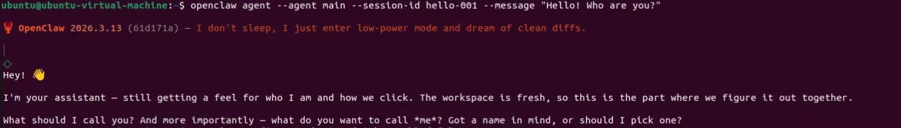
</div>

* **Step 3: Open TUI to View the Interaction**

```bash
openclaw tui
```

<div align="center">
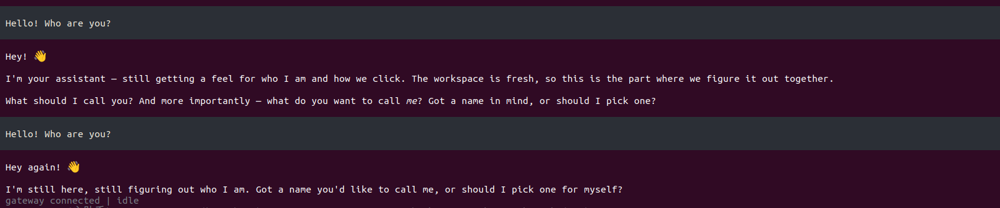
</div>

If a response appears, the environment setup and model call are working correctly.

At this point, the first part of the core loop is complete.

1. The **Gateway** is running.
2. A message has entered a **Session**.
3. The **Agent** has generated a model response and returned it.

This is the foundation for building a complete OpenClaw setup with **Channel** integration, multi-Agent coordination, and **Skill** extensions.

## 3.8 Recommended First-Time Verification

After the Hello World test runs successfully, perform a global check with the following steps. This helps avoid a false positive where only a single message happens to work.

* **Step 1: Confirm That the Gateway Is Running**

```bash
openclaw gateway status
```

* **Step 2: Check Overall Health**

```bash
openclaw doctor
```

If the command supports `--deep`, run the following command as well.

```bash
openclaw doctor --deep
```

* **Step 3: Open the Web Dashboard**

```bash
openclaw dashboard
```

Open the following address in a browser. This address usually points to the local machine.

- `http://127.0.0.1:18789/`

If the port is different, use the value of `gateway.port` in `openclaw.json`.

* **Step 4: Verify Session Continuity with the Same `session-id`**

If **Session** is working properly, the second message will continue from the context of the first message.

```bash
openclaw agent --agent main --session-id hello-001 --message "Summarize what OpenClaw is in one sentence."
openclaw agent --agent main --session-id hello-001 --message "Make the summary more beginner-friendly and list the next step."
```

## 3.9 Common Issues and Basic Checks

* **1. `openclaw` command not found**

The global installation path is usually not added to `PATH`. First, run the following command.

```bash
npm config get prefix
```

Then check whether the corresponding `bin` directory is included in `PATH`.

* **2. Gateway fails to start after `openclaw onboard` is complete**

Avoid changing configuration files before checking the basic status and logs. Check in the following order.

1. Run `openclaw doctor`.
2. Run the **Gateway** in the foreground to view detailed errors. If the current version supports `run --verbose`, use that mode.

For example:

```bash
openclaw doctor
```

Record the key error lines. The following chapters will explain how to troubleshoot based on the actual error.

* **3. The Dashboard cannot be opened, or the port cannot be accessed**

Check the following two items first.

1. Whether `openclaw gateway status` shows that the **Gateway** is running.
2. Whether `gateway.port` has been changed, and whether the firewall allows this port when access is from a local network.
