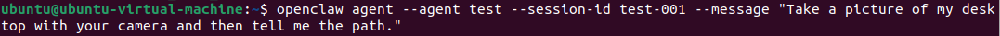
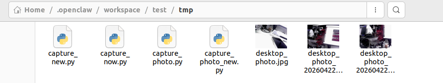
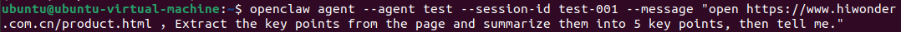
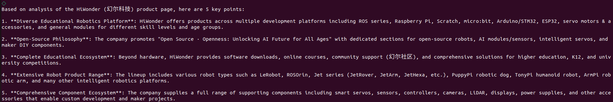
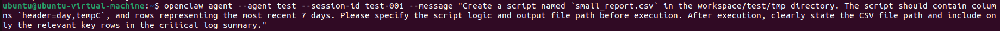
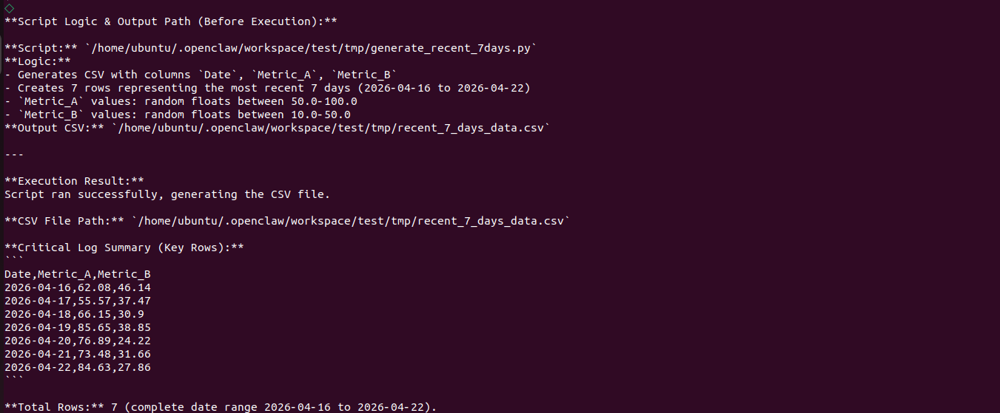
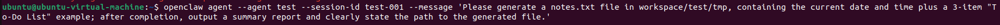
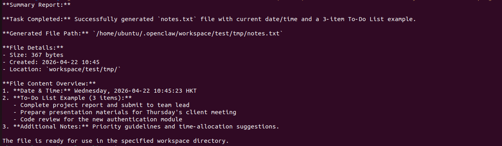

# 4. Creating the First Agent

This chapter uses the configured `test` Agent, an execution-oriented multimodal assistant, as the example. It covers the workflow from preparing workspace convention files, registering the Agent in `openclaw.json`, and verifying through the CLI whether the Agent can break down and execute tasks as expected.

The behavior of the `test` can be understood through seven relatively independent modules.

1. Autonomous task breakdown into 3-7 steps.
2. File management.
3. Camera capture.
4. Browser control.
5. Script execution.
6. Proactive feedback with step-by-step progress updates during execution.
7. Information consolidation with a final report after completion.

## 4.1 Define the `test` Agent Through Workspace Convention Files

In `openclaw.json`, the key paths for `test` are listed below.

1. `workspace`: **/home/ubuntu/.openclaw/workspace/test**.
2. `agentDir`: **/home/ubuntu/.openclaw/agents/test/agent**.

In an actual environment, create the directories first, then prepare the convention files. The model reads these files to determine how it should behave.

* **Step 1: Create Directories**

```bash
mkdir -p ~/.openclaw/workspace/test
mkdir -p ~/.openclaw/agents/test/agent
```

* **Step 2: Create or Overwrite the Convention Files**

Create at least the following files.

```bash
touch ~/.openclaw/workspace/test/AGENTS.md
touch ~/.openclaw/workspace/test/SOUL.md
touch ~/.openclaw/workspace/test/USER.md
touch ~/.openclaw/workspace/test/IDENTITY.md
```

The following file is also recommended.

```bash
touch ~/.openclaw/workspace/test/TOOLS.md
```

In the repository, these files already contain final template-level content. Later sections explain how the `test` runs based on these files.

## 4.2 Register `test` in `openclaw.json`

First, confirm that `openclaw.json` contains an Agent entry with `id = "test"` and includes the following two types of key configuration.

### 4.2.1 `openclaw.json` Configuration Snippet for Reference

```json
{
  "id": "test",
  "name": "test (execution-oriented multimodal assistant)",
  "workspace": "/home/ubuntu/.openclaw/workspace/test",
  "agentDir": "/home/ubuntu/.openclaw/agents/test/agent",
  "model": "deepseek/deepseek-reasoner",
  "identity": {
    "name": "test (execution-oriented multimodal assistant)"
  },
  "tools": {
    "allow": [
      "read",
      "write",
      "edit",
      "apply_patch",
      "exec",
      "process",
      "browser",
      "web_search",
      "web_fetch",
      "memory_search",
      "memory_get",
      "session_status",
      "sessions_list",
      "sessions_history",
      "message",
      "nodes",
      "image"
    ],
    "deny": [
      "sessions_spawn",
      "subagents",
      "canvas",
      "cron",
      "gateway"
    ]
  }
}
```

Full configuration for reference only.

```json
{
  "meta": {
    "lastTouchedVersion": "2026.3.24",
    "lastTouchedAt": "2026-03-28T06:48:48.260Z"
  },
  "wizard": {
    "lastRunAt": "2026-03-28T06:48:44.941Z",
    "lastRunVersion": "2026.3.24",
    "lastRunCommand": "onboard",
    "lastRunMode": "local"
  },
  "auth": {
    "profiles": {
      "deepseek:default": {
        "provider": "deepseek",
        "mode": "api_key"
      }
    }
  },
  "models": {
    "mode": "merge",
    "providers": {
      "deepseek": {
        "baseUrl": "https://api.deepseek.com",
        "api": "openai-completions",
        "models": [
          {
            "id": "deepseek-chat",
            "name": "DeepSeek Chat",
            "api": "openai-completions",
            "reasoning": false,
            "input": [
              "text"
            ],
            "cost": {
              "input": 0.28,
              "output": 0.42,
              "cacheRead": 0.028,
              "cacheWrite": 0
            },
            "contextWindow": 131072,
            "maxTokens": 8192,
            "compat": {
              "supportsUsageInStreaming": true
            }
          },
          {
            "id": "deepseek-reasoner",
            "name": "DeepSeek Reasoner",
            "api": "openai-completions",
            "reasoning": true,
            "input": [
              "text"
            ],
            "cost": {
              "input": 0.28,
              "output": 0.42,
              "cacheRead": 0.028,
              "cacheWrite": 0
            },
            "contextWindow": 131072,
            "maxTokens": 65536,
            "compat": {
              "supportsUsageInStreaming": true
            }
          }
        ]
      }
    }
  },
  "agents": {
    "defaults": {
      "model": {
        "primary": "deepseek/deepseek-chat"
      },
      "models": {
        "deepseek/deepseek-chat": {
          "alias": "DeepSeek"
        },
        "deepseek/deepseek-reasoner": {
          "alias": "DeepSeek Reasoner"
        }
      },
      "workspace": "/home/ubuntu/.openclaw/workspace/main"
    },
    "list": [
      {
        "id": "main",
        "default": true,
        "name": "Main assistant",
        "workspace": "/home/ubuntu/.openclaw/workspace/main",
        "agentDir": "/home/ubuntu/.openclaw/agents/main/agent"
      },
      {
        "id": "test",
        "name": "test (execution-oriented multimodal assistant)",
        "workspace": "/home/ubuntu/.openclaw/workspace/test",
        "agentDir": "/home/ubuntu/.openclaw/agents/test/agent",
        "model": "deepseek/deepseek-reasoner",
        "identity": {
          "name": "test (execution-oriented multimodal assistant)"
        },
        "tools": {
          "allow": [
            "read",
            "write",
            "edit",
            "apply_patch",
            "exec",
            "process",
            "browser",
            "web_search",
            "web_fetch",
            "memory_search",
            "memory_get",
            "session_status",
            "sessions_list",
            "sessions_history",
            "message",
            "nodes",
            "image"
          ],
          "deny": [
            "sessions_spawn",
            "subagents",
            "canvas",
            "cron",
            "gateway"
          ]
        }
      }
    ]
  },
  "tools": {
    "profile": "coding"
  },
  "commands": {
    "native": "auto",
    "nativeSkills": "auto",
    "restart": true,
    "ownerDisplay": "raw"
  },
  "session": {
    "dmScope": "per-channel-peer"
  },
  "hooks": {
    "internal": {
      "enabled": true,
      "entries": {
        "session-memory": {
          "enabled": true
        },
        "command-logger": {
          "enabled": true
        }
      }
    }
  },
  "channels": {
    "feishu": {
      "enabled": true,
      "appId": "cli_a94dc45575389cdd",
      "appSecret": "SuWncFnIPRCbPo7cNaQzAd06uduDtrAt",
      "connectionMode": "websocket",
      "domain": "feishu",
      "groupPolicy": "open"
    }
  },
  "gateway": {
    "port": 18789,
    "mode": "local",
    "bind": "loopback",
    "auth": {
      "mode": "token",
      "token": "822f2e9d3e9e425f4e8e4c080005018ae153b096bb758482"
    },
    "tailscale": {
      "mode": "off",
      "resetOnExit": false
    },
    "nodes": {
      "denyCommands": [
        "screen.record",
        "contacts.add",
        "calendar.add",
        "reminders.add",
        "sms.send"
      ]
    }
  },
  "plugins": {
    "entries": {
      "feishu": {
        "enabled": true
      }
    }
  }
}
```

### 4.2.2 `systemPrompt`: Execution Rules

The current `test.systemPrompt` focuses on the following requirements.

- For complex goals, output a 3-7 step task breakdown first, with the required tools marked for each step.
- During execution, provide feedback immediately after each step is completed, including the status, output such as a path, screenshot, URL, or key log, the next step, or questions that require confirmation.
- After completion, consolidate the information, including a summary, output list, key log summary, unresolved items, and next steps.
- Safety comes first. Ask for confirmation when parameters are unclear or when an operation may cause major loss. Do not expose private information or keys.

### 4.2.3 `test.tools`: Allowed and Denied Actions

The current permission strategy allows execution and output generation while restricting high-risk system capabilities.

- Allowed: **read/write/edit/apply_patch/exec/process/browser/web_search/web_fetch/.../message/nodes/image**.
- Denied: **sessions_spawn/subagents/canvas/cron/gateway**.

These permissions directly affect whether the `test` can write files, run scripts, open a browser, or take pictures.

After changing the configuration, restart the Gateway immediately.

```bash
openclaw gateway restart
```

### 4.2.4 Workspace Configuration Code for `workspace/test`

The following is a minimal configuration example that can run. Start with this version, then extend it as needed for the actual application.

* `workspace/test/AGENTS.md`: Execution Rules

```md
# AGENTS.md — How the test Execution Agent Works

## Session Start
1. Read SOUL.md, USER.md, IDENTITY.md, and TOOLS.md.
2. Read today's and yesterday's notes under memory/ if they exist.

## Task Breakdown
- Break down complex tasks first.
- Each step must include the purpose, expected output, and tool.

## Proactive Feedback
- Provide feedback immediately after each step is completed, including status, output, and next step.

## Information Consolidation
- At the end, output the current summary, output list, key log summary, and unresolved items.
```

* `workspace/test/SOUL.md`: Style and Boundaries

```md
# SOUL.md

This is an execution-oriented Agent, not a chatbot.
- Break down the task before execution.
- Ask when uncertain.
- Do not expose private information or keys.
- Confirm before destructive actions.
```

* `workspace/test/USER.md`: Default Preferences

```md
# USER.md

- Timezone: Asia/Shanghai
- Work scope, only write here by default: workspace/test
- Camera alias: default
- Default script execution directory: workspace/test
- Script output directory: workspace/test/tmp
```

* `workspace/test/IDENTITY.md`: Identity

```md
# IDENTITY.md

- Name: test execution-oriented multimodal assistant
- Creature: Practical execution agent
- Vibe: Structured, auditable, and plan-driven
```

* `workspace/test/TOOLS.md`: Tool Conventions

```md
# TOOLS.md

## Cameras
- default: system default camera

## Browser
- Record the final URL and key page points.

## Script Execution
- Default working directory: workspace/test
- Output directory: workspace/test/tmp
- Confirm before destructive commands.
```

## 4.3 Autonomous Task Breakdown

Both `AGENTS.md` and `systemPrompt` require a task breakdown list before execution when a goal involves multiple capabilities or a relatively large task.

The breakdown rules for the `test` are listed below.

1. Output a Step list.
2. Clearly state the purpose, expected output, and required tools for each step.
3. If file writing, script execution, device operation, or similar actions are involved, list risks and pending confirmations first. Execution can continue only after the parameters are clear.
4. Write observable results for the model.

A structure similar to the following should appear in the conversation.

1. Step 1: xx, purpose.
2. Step 2: xx, purpose.
3. Each step corresponds to a tool type, such as file, camera, browser, or script.

If no breakdown appears, follow the troubleshooting order in [4.11 Log Analysis and Troubleshooting Order](#anther4-11). This is usually caused by insufficient parameters or the execution-oriented process not being triggered correctly.

1. Related configuration for file management.
2. `openclaw.json`: `test.systemPrompt`, which enforces task breakdown before execution.
3. `workspace/test/AGENTS.md`: **Task Breakdown** rules.

## 4.4 File Management (Read\Create\Update\Archive)

In the repository, `workspace/test/AGENTS.md` divides file management into three types of actions and requires output paths to be traceable.

1. Read: use `read` first.
2. Create or update: use `write`, `edit`, or `apply_patch`.
3. Archive: write key results and paths into the consolidated report instead of leaving only a single sentence.

* Minimum Input Requirements

When the `test` is expected to manage files, at least the following points should be clear.

1. The relative path of the target file or directory, such as `workspace/test/tmp/notes.txt`.
2. Content requirements, such as the format, required fields, and number of records.
3. Expected output.

The proactive feedback and final consolidated report should include the following information.

1. The path of the file that was written or updated successfully.
2. Key content points, with a summary when needed.
3. Related configuration for camera capture.
4. `openclaw.json`: `test.tools.allow` must include `read/write/edit/apply_patch`.
5. `workspace/test/AGENTS.md`: file results must be written into the **Output List**.

## 4.5 Camera Capture

`workspace/test/USER.md` defines the camera alias convention.

Camera alias: `default` = system default camera.

`AGENTS.md` defines the following requirements for camera operations.

1. Confirm the camera alias first. If no alias is provided, use the `default`.
2. Confirm the capture content, angle, and whether continuous capture is required. Ask first if parameters are missing.
3. After capture, record the image output link or saved path in the consolidated report.
4. If capture fails, state the reason and provide the next step, such as changing the alias, retrying, or manually taking and uploading an image.
5. Optional test prompt for the camera.

If the current environment has camera permissions, the following prompt can be used for testing.

```bash
openclaw agent --agent test --session-id test-001 --message "Take a picture of my desktop with your camera and then tell me the path."
```

<div align="center">

</div>

1. Related configuration for camera capture.
2. `workspace/test/USER.md`: camera alias `default`.
3. `openclaw.json`: `test.tools.allow` includes `image`, if the current environment provides camera capture through this tool.

<div align="center">

</div>

<div align="center">

</div>

## 4.6 Browser Control

`AGENTS.md` defines the following constraints for browser control.

- Open or navigate: record the final URL.
- When page content is needed: use `web_fetch` or a browser tool to fetch the content and consolidate the key points.
- Information consolidation: output only summaries and structured conclusions to avoid exposing sensitive page content.

* Optional Test Prompt for the Browser

```bash
openclaw agent --agent test --session-id test-001 --message "Open https://www.hiwonder.com.cn/product.html, extract the key points from the page, summarize them into 5 key points, and return the result."
```

<div align="center">

</div>

* Related Configuration for Browser Control

- `openclaw.json`: `test.tools.allow` includes `browser/web_fetch/web_search`.
- `workspace/test/TOOLS.md`: requires the final URL and key points to be recorded.

<div align="center">

</div>

## 4.7 Script Execution

The current `AGENTS.md` and `TOOLS.md` define script execution as auditable and low-risk.

- Run in `workspace/test` by default.
- Before each execution, restate the command or script summary and the expected output file path.
- After execution, consolidate the runtime log summary, including key `stdout` and `stderr` lines, and the output path.
- Script outputs and intermediate files should be written to `workspace/test/tmp` first.

* Minimal Verifiable Test

The following case is well-suited for verifying task breakdown, execution, and consolidation.

```bash
openclaw agent --agent test --session-id test-001 --message "Create a script named `small_report.csv` in the workspace/test/tmp directory. The script should contain columns `header=day,tempC`, and rows representing the most recent 7 days. Please specify the script logic and output file path before execution. After execution, clearly state the CSV file path and include only the relevant key rows in the critical log summary."
```

<div align="center">

</div>

* Related Configuration for Proactive Feedback

- `openclaw.json`: `test.tools.allow` includes `exec/process`.
- `workspace/test/USER.md` and `TOOLS.md`: default directory `workspace/test` and output directory `workspace/test/tmp`.

<div align="center">

</div>

## 4.8 Proactive Feedback

Both `systemPrompt` and `AGENTS.md` require feedback during execution instead of only reporting at the end.

The proactive feedback from the `test` should include the following structure.

- Step: number or name.
- Status: completed, in progress, or failed, with the reason for failure.
- Output: file path, screenshot path, URL, or key text points.
- Next step: the next action, or a direct question if confirmation is required.

This makes it easier to identify where execution is blocked.

* Related Configuration for Information Consolidation

- `openclaw.json`: `test.systemPrompt` clearly requires feedback immediately after each step is completed.
- `workspace/test/AGENTS.md`: the `## Proactive Feedback` section.

## 4.9 Information Consolidation

After all steps are complete, the `test` must output a consolidated report with the following information.

1. Summary for the current run in 3-6 lines.
2. Output list grouped by capability, including files, images, web page points, and script results.
3. Key log summary, keeping only the lines related to the output.
4. Unresolved items and next steps.

* Acceptance Criteria

- The consolidated report must include traceable information such as paths, URLs, or screenshots.
- The key log summary should be closely related to the final output. It should not include a large amount of irrelevant output.

* Related Configuration

- `openclaw.json`: `test.systemPrompt` clearly requires information consolidation after completion.
- `workspace/test/AGENTS.md`: the `## Information Consolidation` section.

## 4.10 Run and Test Through the CLI

* **Step 1: Restart the Gateway**

```bash
openclaw gateway restart
```

<div align="center">

</div>

* **Step 2: Test File Output and the Consolidated Report**

```bash
openclaw agent --agent test --session-id test-001 --message "Please generate a notes.txt file in workspace/test/tmp, containing the current date and time plus a 3-item \"To-Do List\" example. After completion, output a summary report and clearly state the path to the generated file."
```

<div align="center">

</div>

<div align="center">

</div>
<p id ="p4-11"></p>

## 4.11 Log Analysis and Troubleshooting Order

If the `test` has problems such as no task breakdown, no path output, no generated file, an incomplete consolidated report, or execution failure, check in the following order.

- Confirm that the Gateway is running.

```bash
openclaw gateway status
```

- Run the Gateway in the foreground to get detailed errors.

```bash
openclaw gateway run --verbose
```

- Run a general diagnosis.

```bash
openclaw doctor
```

- Check the execution trace in `agentDir`. This is the most important step.

The `agentDir` of `test` is shown below.

```bash
/home/ubuntu/.openclaw/agents/test/agent
```

In the corresponding session directory or `*.json` trace files, the timeline of tools and execution steps can usually be found. This helps locate the following issues.

- Why a Step was not executed, such as missing parameters or a failed safety confirmation.
- Why is the output path empty, such as write permission issues or a path mismatch?

## 4.12 Summary

- This chapter used the `test` as an example and divided the key capabilities of an execution-oriented Agent into seven modules: autonomous breakdown, file management, camera capture, browser control, script execution, proactive feedback, and information consolidation.
- The `systemPrompt` and `tools allow/deny` settings of `test` in `openclaw.json` define how its behavior is constrained.
- CLI cases can be used to verify whether the breakdown appears, whether each step provides feedback, and whether the final consolidated report includes paths, URLs, and key log summaries.
