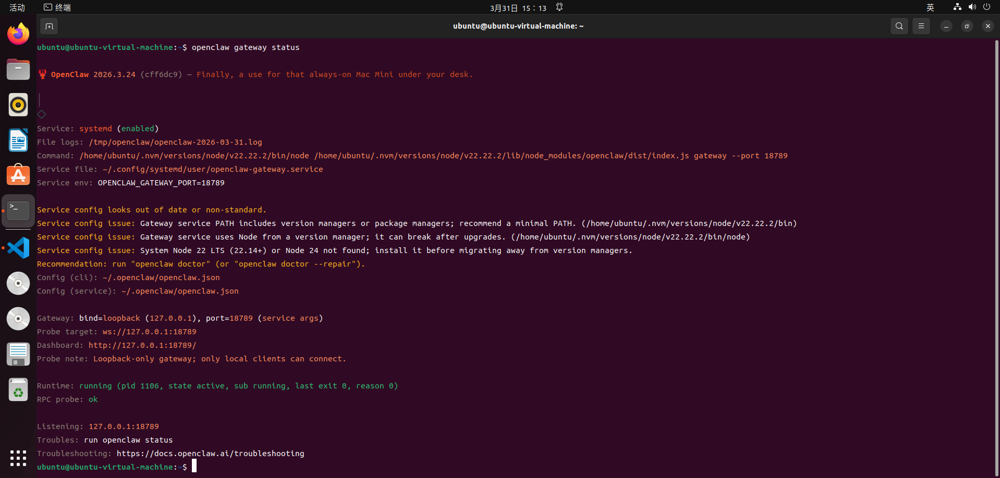
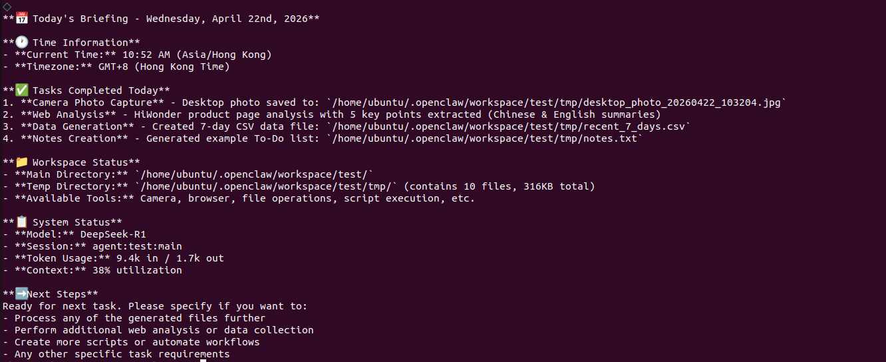

# 5. Tool Debugging from Scratch

## 5.1 Minimum Closed Loop

The loop built in this chapter can be summarized as follows.

> [!NOTE]
>
> **Trigger phrases for Today's briefing and city weather -> Agent selects a Skill -> Skill calls `web_fetch` or `web_search` step by step -> the response is assembled in a fixed format and returned.**

The relationship can be reviewed based on [Chapter 1. OpenClaw Overview]() and [Chapter 2. OpenClaw Core Concepts]().

- **Gateway**: Routes messages to the **test Agent**.
- **Agent**: Decides when to use a **Skill** and which tools are required.
- **Skill**: Defines activation conditions, output format, execution steps, and constraints.
- **Tool**: Fetches People's Daily Online hot topics and weather information from the web.

## 5.2 Preparation

* **Step 1: Confirm That the Gateway Is Running**

```bash
openclaw gateway status
```

<div align="center">

</div>

If the **Gateway** is not running, start it first.

```bash
openclaw gateway start
```

<div align="center">

</div>

* **Step 2: Run a Quick Health Check for Configuration Validation**

```bash
openclaw doctor
```

<div align="center">

</div>

* **Step 3: Confirm that the `test` Agent Exists**

```bash
openclaw agents list --json
```

<div align="center">

</div>

The output should include an entry similar to the following.

<div align="center">

</div>

> [!NOTE]
>
> **This step is important. Later, the Skill configuration must be bound to an Agent. Without this `id`, joint debugging cannot continue.**

## 5.3 Set Up the Workspace Conventions for the `test` Agent

[Chapter 4]() explains that the **test** is not a general chat agent. It performs execution-focused work according to predefined conventions.

When building from scratch, make sure the `workspace` of the **test agent** contains at least the following files.

1. `AGENTS.md`: Session startup flow, tool usage conventions, and final output collection format.
2. `SOUL.md`, `USER.md`, and `IDENTITY.md`: Tone, preferences, identity display, and related settings.
3. `TOOLS.md`: Optional local tool notes, such as camera aliases.

Use the actual path in `openclaw.json`. Find the entry with `id: "test"` under `agents.list`, then check the following fields.

1. `workspace`
2. `agentDir`

Create these files under `workspace`, or use the existing file content.

> [!NOTE]
>
> **If `workspace/test/AGENTS.md` and related files already exist in this repository, they can remain unchanged. This chapter focuses on the Skill -> tool call -> joint debugging flow.**

## 5.4 Write the `daily-briefing-weather` Skill from Scratch

* **Step 1: Create the Skill Directory**

Create the Skill directory under the `workspace` of the **test**.

```bash
mkdir -p ~/.openclaw/workspace/test/skills/daily-briefing-weather
```

* **Step 2: Create `SKILL.md`**

A **Skill** uses `SKILL.md` to tell the model the following information.

1. Activation conditions, including trigger phrases and request wording.
2. Output format, using a fixed template.
3. Execution steps, with weather first, hot topics next, and final assembly last.
4. Constraints, including no fabricated information when retrieval fails.

Write the following content. It can be used directly as a template.

```md
---
name: daily-briefing-weather
description: >-
  Build a daily briefing when the request asks for Today's briefing, What's trending today, or Hot topic briefing. Answer city weather queries such as How is the weather in New York today? Fetch hot topics from People's Daily Online and weather from web sources, then output in this fixed format: Daily briefing: 1. Weather: {result}. Hot topics: {Title 1: brief summary, Title 2: brief summary...}.
version: "1.0.0"
---

# Daily Briefing and City Weather

## When to Activate

- The request says: `Today's briefing`, `What's trending today`, or `Hot topic briefing`.
- The request says: `How is the weather in <city> today?`, `Today's weather in <city>`, or `<city> weather`.

## Fixed Output Format

Always return one line or multiple lines with equivalent content. Keep the structure unchanged.

`Daily briefing: 1. Weather: {result}. Hot topics: {Title 1: brief summary, Title 2: brief summary...}`

Rules:
- The weather section should include key information for the day, such as weather conditions, temperature range, precipitation, wind, or comfort advice.
- Include at least 3 hot topics, usually 3 to 6. Each item should follow `Title: one-sentence summary`.
- If any item cannot be retrieved, clearly write `Not available yet`. Do not fabricate information.

## Execution Steps

1. Identify the intent
   - For `Today's briefing` or `What's trending today`, provide hot topics first by default and include the current session city weather when available.
   - For `How is the weather in <city> today?`, set `<city>` to the city mentioned in the request and include a hot topic summary.

2. Get weather
   - Prefer `web_fetch`: `https://wttr.in/<city>?lang=en` or `https://wttr.in/<city>?format=j1`.
   - If it fails, use `web_search` to search `<city> weather today`. Prioritize authoritative sources and extract same-day information.

3. Get hot topics from People's Daily Online
   - Use `web_fetch` to fetch `https://www.people.com.cn/`.
   - Select same-day hot topic headlines from homepage sections such as top news, breaking news, economy, technology, society, education, international news, or military news.
   - Write one brief summary for each headline based on visible page summaries. Do not speculate.

4. Assemble and respond
   - Follow the fixed output format strictly.
   - Use English by default. Keep the response concise and avoid unrelated greetings.

## Constraints

- Prioritize visible on-site information from People's Daily Online. Do not invent details.
- If the request asks only for weather, still return the fixed format and add hot topics.
- If the request asks only for hot topics, still return the fixed format and include weather. If no city can be determined, write `No city specified. Weather is not available yet`.
```

## 5.5 Register the Skill with `test` in `openclaw.json`

The string in the `skills` array of the **Agent** must match the `name` field in the header of `SKILL.md`.

* **Step 1: Edit `openclaw.json`**.

Find the entry with `id: "test"` under `agents.list`, then add the following field.

```json
"skills": ["daily-briefing-weather"]
```

Complete configuration for reference only.

```json
{
  "meta": {
    "lastTouchedVersion": "2026.3.24",
    "lastTouchedAt": "2026-03-31T03:53:19.728Z"
  },
  "wizard": {
    "lastRunAt": "2026-03-31T03:53:19.689Z",
    "lastRunVersion": "2026.3.24",
    "lastRunCommand": "doctor",
    "lastRunMode": "local"
  },
  "auth": {
    "profiles": {
      "deepseek:default": {
        "provider": "deepseek",
        "mode": "api_key"
      }
    }
  },
  "models": {
    "mode": "merge",
    "providers": {
      "deepseek": {
        "baseUrl": "https://api.deepseek.com",
        "api": "openai-completions",
        "models": [
          {
            "id": "deepseek-chat",
            "name": "DeepSeek Chat",
            "api": "openai-completions",
            "reasoning": false,
            "input": [
              "text"
            ],
            "cost": {
              "input": 0.28,
              "output": 0.42,
              "cacheRead": 0.028,
              "cacheWrite": 0
            },
            "contextWindow": 131072,
            "maxTokens": 8192,
            "compat": {
              "supportsUsageInStreaming": true
            }
          },
          {
            "id": "deepseek-reasoner",
            "name": "DeepSeek Reasoner",
            "api": "openai-completions",
            "reasoning": true,
            "input": [
              "text"
            ],
            "cost": {
              "input": 0.28,
              "output": 0.42,
              "cacheRead": 0.028,
              "cacheWrite": 0
            },
            "contextWindow": 131072,
            "maxTokens": 65536,
            "compat": {
              "supportsUsageInStreaming": true
            }
          }
        ]
      }
    }
  },
  "agents": {
    "defaults": {
      "model": {
        "primary": "deepseek/deepseek-chat"
      },
      "models": {
        "deepseek/deepseek-chat": {
          "alias": "DeepSeek"
        },
        "deepseek/deepseek-reasoner": {
          "alias": "DeepSeek Reasoner"
        }
      },
      "workspace": "/home/ubuntu/.openclaw/workspace/main"
    },
    "list": [
      {
        "id": "main",
        "default": true,
        "name": "Main Assistant",
        "workspace": "/home/ubuntu/.openclaw/workspace/main",
        "agentDir": "/home/ubuntu/.openclaw/agents/main/agent"
      },
      {
        "id": "test",
        "name": "test, execution-focused multimodal assistant",
        "workspace": "/home/ubuntu/.openclaw/workspace/test",
        "agentDir": "/home/ubuntu/.openclaw/agents/test/agent",
        "model": "deepseek/deepseek-reasoner",
        "skills": [
          "daily-briefing-weather"
        ],
        "identity": {
          "name": "test, execution-focused multimodal assistant"
        },
        "tools": {
          "allow": [
            "read",
            "write",
            "edit",
            "apply_patch",
            "exec",
            "process",
            "browser",
            "web_search",
            "web_fetch",
            "memory_search",
            "memory_get",
            "session_status",
            "sessions_list",
            "sessions_history",
            "message",
            "nodes",
            "image"
          ],
          "deny": [
            "sessions_spawn",
            "subagents",
            "canvas",
            "cron",
            "gateway"
          ]
        }
      }
    ]
  },
  "tools": {
    "profile": "coding"
  },
  "commands": {
    "native": "auto",
    "nativeSkills": "auto",
    "restart": true,
    "ownerDisplay": "raw"
  },
  "session": {
    "dmScope": "per-channel-peer"
  },
  "hooks": {
    "internal": {
      "enabled": true,
      "entries": {
        "session-memory": {
          "enabled": true
        },
        "command-logger": {
          "enabled": true
        }
      }
    }
  },
  "channels": {
    "feishu": {
      "enabled": true,
      "appId": "cli_a94dc45575389cdd",
      "appSecret": "SuWncFnIPRCbPo7cNaQzAd06uduDtrAt",
      "connectionMode": "websocket",
      "domain": "feishu",
      "groupPolicy": "open"
    }
  },
  "gateway": {
    "port": 18789,
    "mode": "local",
    "bind": "loopback",
    "auth": {
      "mode": "token",
      "token": "822f2e9d3e9e425f4e8e4c080005018ae153b096bb758482"
    },
    "tailscale": {
      "mode": "off",
      "resetOnExit": false
    },
    "nodes": {
      "denyCommands": [
        "screen.record",
        "contacts.add",
        "calendar.add",
        "reminders.add",
        "sms.send"
      ]
    }
  },
  "plugins": {
    "entries": {
      "feishu": {
        "enabled": true
      }
    }
  }
}
```

* **Step 2: Make sure the required tool permissions are allowed**.

In the same **test agent** entry, check that `tools.allow` contains at least the following tools.

1. `web_fetch`
2. `web_search`

```json
        "tools": {
          "allow": [
            "read",
            "exec",
            "process",
            "web_search",
            "web_fetch",
            "memory_search",
            "memory_get",
            "session_status",
            "sessions_list",
            "sessions_history",
            "message"
          ],
```

> [!NOTE]
>
> **Without `web_fetch` and `web_search`, even a well-written Skill may only generate a description instead of fetching facts.**

* **Step 3: Optional but strongly recommended, name the trigger in `systemPrompt`**.

To make Skill selection more stable, add the following hard rule to the `systemPrompt` of `test`.

> When the request mentions `Today's briefing`, `What's trending today`, or `How is the weather in <city> today?`, use the `daily-briefing-weather` Skill first.

If a similar configuration already exists in this repository, this step mainly explains why the Skill can be triggered when building from scratch.

## 5.6 Restart the Gateway and Run Joint Debugging

* **Step 1: Restart the Gateway**.

```bash
openclaw gateway restart
```

* **Step 2: Run a Skill self-check to confirm availability and discoverability**.

```bash
openclaw skills list -v
openclaw skills check --json
```

* **Step 3: Trigger both debugging cases with fixed phrases**.

1. Hot topic briefing:

```bash
openclaw agent --agent test --session-id test-002 --message "Today's briefing."
```

<div align="center">

</div>

<div align="center">

</div>

## 5.7 Troubleshooting Guide

1. **Skill Is Not Triggered**  
   Check whether `description` contains the actual trigger phrases in use and whether `test.systemPrompt` names this Skill.
2. **Skill Is Triggered, but No Fetching Happens**  
   Check whether `test.tools.allow` allows `web_fetch` and `web_search`.
3. **Restart Does Not Take Effect**  
   After modifying `openclaw.json`, `openclaw gateway restart` must be run.
4. **Fetching Fails but Fabrication Must Be Avoided**  
   The Skill requires `Not available yet` when retrieval fails. If fabricated content appears, review the execution steps and constraints.
