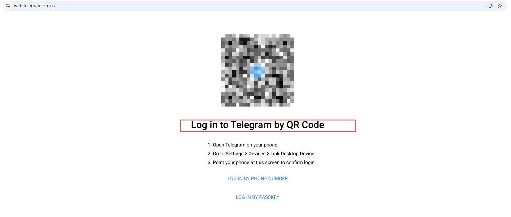
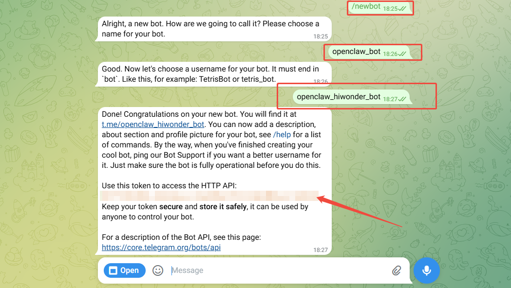
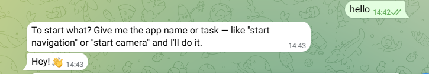

# 6. Telegram Application Configuration

## 6.1 Minimum Working Loop

The minimum working loop in this chapter can be summarized as follows:

> Telegram message trigger -> **Gateway** routes the message to the email **Agent** -> `email-fetch` retrieves emails -> `mail-agent` performs structured analysis -> `feishu-send` pushes the result back to the group chat.

In this loop, each component has a clear role.

1. `Gateway`: Receives Telegram events and routes sessions.
2. `Agent`: Determines the workflow and selects the required **Skill**.
3. `Skills`: Handle email retrieval, analysis, and message pushing.
4. `Workflow`: Connects retrieval, analysis, and pushing into a fixed process.

**This chapter covers the first and most important part of the loop: connecting Telegram to the OpenClaw Gateway. The email and Telegram integration will be covered in later chapters.**

## 6.2 Preparation

* **Step 1: Confirm that OpenClaw is running properly.**

Run the following commands in the terminal to confirm that the **Gateway** status is normal and the environment has no configuration issues.

```bash
openclaw gateway status
openclaw doctor
```

* **Step 2: Confirm that the Agent for the email workflow exists.**

An **Agent** is required for the email workflow covered in later chapters. Run the following command to view the current **Agent** list:

```bash
openclaw agents list --json
```

> [!NOTE]
>
> **The following steps use the Agent named `main` by default.**

* **Step 3: Confirm that a Telegram account is available.**

Make sure a Telegram account is available and ready to use.

## 6.3 Telegram Configuration

> [!NOTE]
>
> **Telegram can be set up from either the app or Telegram Web. The steps below use Telegram Web.**

Telegram Web address: https://web.telegram.org/k/

* **Step 1: Log in to Telegram.**

Scan the QR code with the app, or log in with a phone number and verification code.

<div align="center">

</div>

* **Step 2: Search for BotFather.**

Search for **BotFather** in the search bar at the upper-left corner of Telegram, then open the officially verified account with the blue checkmark.

<div align="center">

</div>

* **Step 3: Create a bot and get the token.**

Send `/newbot` in the chat to create a Bot and get the Token. The bot username must end with `_bot`.

> [!NOTE]
>
> **A Token will be generated after the setup is complete. Save it securely and do not share it. This token will be required later in the OpenClaw configuration.**

<div align="center">

</div>

<div align="center">

</div>

## 6.4 Connect Telegram to OpenClaw through the Plugin

After the Telegram bot is ready, configure OpenClaw from the server or local terminal.

* **Step 1**: Enable the Telegram plugin in the OpenClaw config.

```bash
openclaw config set channels.telegram.enabled true
```

<div align="center">

</div>

* **Step 2**: Add the Telegram bot Token to OpenClaw.

```powershell
openclaw config set channels.telegram.botToken "TELEGRAM_BOT_TOKEN"
```

<div align="center">

</div>

* **Step 3**: Start the OpenClaw Gateway service.

```bash
openclaw gateway
```

<div align="center">

</div>

* **Step 4**: In the BotFather chat, click the bot link shown in the message, such as **t.me/openclaw_hiwonder_bot**, to open the bot chat. Then click **START**.

> [!NOTE]
>
> `openclaw gateway` must be started before clicking **START** in Telegram. Otherwise, the pairing code will not be received.

<div align="center">

</div>

<div align="center">

</div>

* **Step 5**: During the first chat, the Telegram Bot sends a pairing code. Run the following command on the server to complete pairing.

<div align="center">

</div>

* **Step 6**: Open a new command-line terminal and run the following command. Replace `<code>` with the Pairing code received in Telegram. **Do not include the angle brackets when entering it.**

```bash
openclaw pairing approve telegram <code>
```

<div align="center">

</div>

* **Step 7**: After the command runs successfully, send a test message to the Telegram Bot, such as `hello`. If the bot replies like an AI assistant, the Telegram connection to OpenClaw is working properly.

<div align="center">

</div>

The Telegram integration for **OpenClaw** is now complete.
