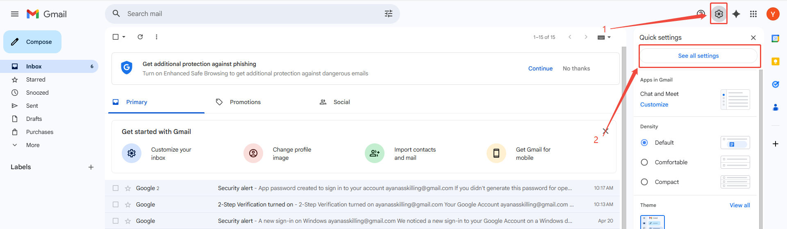
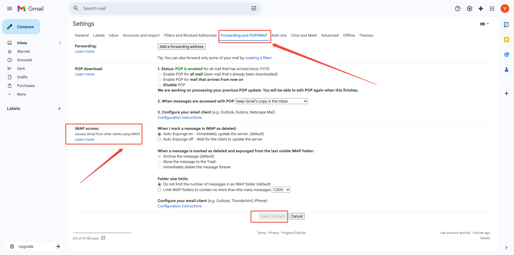
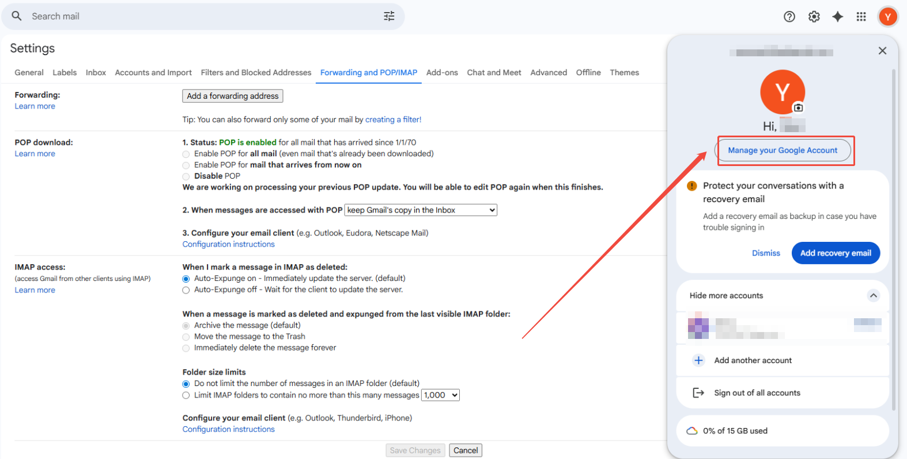
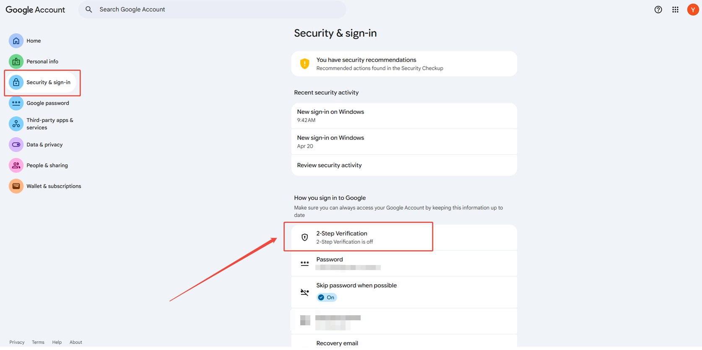
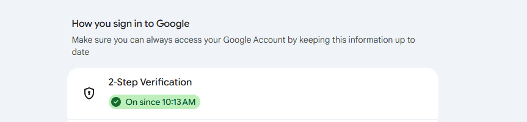
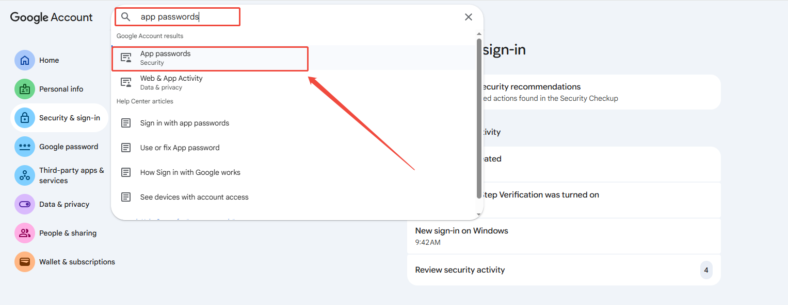
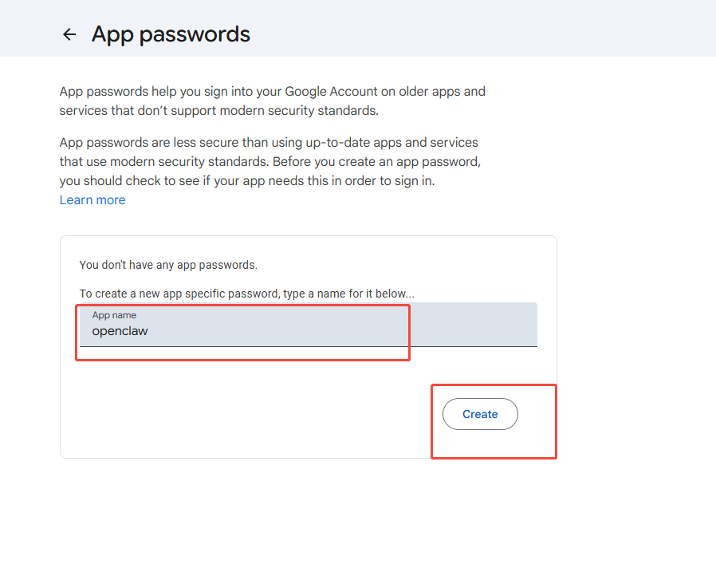
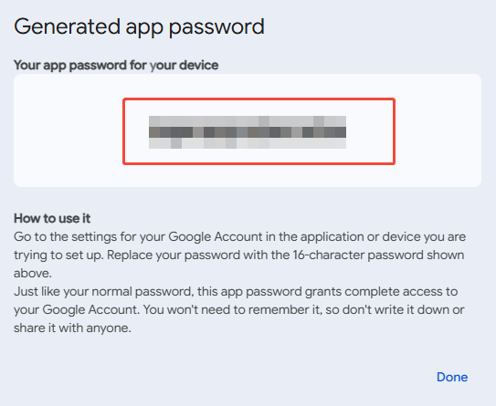
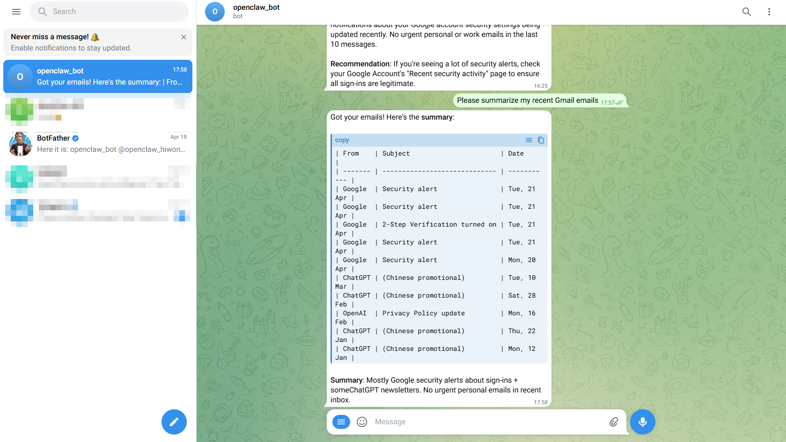

# 7. Smart Email Agent in Practice

> [!NOTE]
>
> **Before starting this chapter, make sure the Telegram bot has been created and connected by following [Chapter 6 Telegram Application Configuration]().**

## 7.1 Framework Setup for Ubuntu and the Main Workspace

* **Step 1: Check the `main` workspace path**

  This chapter uses the **main Agent**. In the configuration file, `workspace` specifies the writable directory for this **Agent**. **Skills**, **MEMORY.md**, and workflow files are all stored in this directory.

* Relative path from the **OpenClaw** data root: `workspace/main`
* Example **OpenClaw** absolute path: `/home/ubuntu/.openclaw/workspace/main`. This path must match the `workspace` field of `main` under `agents.list` in `openclaw.json`.

* **Step 2: Create the directory structure**

Under the **main workspace root**, which is `workspace/main` from the previous step, prepare the following structure:

```text
skills/telegram-mail-orchestrator/
├─ SKILL.md
├─ workflows/default-workflows.json
├─ templates/interactive-confirm-card.json
└─ DEPLOY-UBUNTU.md
MEMORY.md
```

* **Step 3: Define the fixed seven-phase framework**

All later procedures must follow these seven phases in order. No phase should be skipped.

1. Intent recognition and routing
2. Data retrieval
3. Intelligent analysis
4. Memory retrieval
5. Workflow execution
6. Safety checks and manual review
7. Feedback loop

<p id ="p7-2"></p>

## 7.2 Configure Skills for the main Agent

This section creates the rule center first. Refer to [Chapter 5 Tool Debugging from Scratch](), create **SKILL.md**, then attach the **Skill** to **main**.

* **Step 1: Create the Skill directory in Ubuntu**

Run the following commands on the server after changing to the OpenClaw data root directory.

```bash
mkdir -p workspace/main/skills/telegram-mail-orchestrator
mkdir -p workspace/main/skills/telegram-mail-orchestrator/workflows
mkdir -p workspace/main/skills/telegram-mail-orchestrator/templates
```

* **Step 2: Create SKILL.md**

Write the following key rules into the file. The content can be copied directly.

```md
---
name: telegram-mail-orchestrator
description: >-
  Use when a request asks to query, summarize, or draft emails, configure automations,
  or run Telegram-driven IMAP/SMTP workflows with confirmation gates.
version: "1.0.0"
---

# Telegram email multi-agent orchestration center

## Seven-phase execution protocol in strict order
1. Phase 1: Intent recognition and routing for query, summary, drafting, and automation rule setup
2. Phase 2: Data retrieval through read_email(filter)
3. Phase 3: Intelligent analysis through analyze_content(text)
4. Phase 4: Memory retrieval from MEMORY.md
5. Phase 5: Workflow execution through execute_workflow
6. Phase 6: Safety and manual review. Sending and deletion must trigger an inline Telegram confirmation button.
7. Phase 7: Feedback loop through update_memory

## Output format for Telegram
The output must include:
- [Core summary]
- [To-do items]
- [Recommended actions]

## Negative constraints
- Do not delete emails without an explicit instruction.
- Workflows must prevent infinite loops through max_steps and idempotency.
- For 429 errors, return: Too many requests at the moment. A log has been recorded. Please try again later.
```

* **Step 3: Attach the Skill to `main` in `openclaw.json`**

Edit the item with `id` set to `main` in `agents.list` inside `openclaw.json`.

1. If the item **already has** `"skills": [...]`, add the string `"telegram-mail-orchestrator"` to the array or merge it with other Skills in the current environment.
2. If the item **does not have** a `skills` field, which is common for the default `main` Agent with only `id`, `name`, `workspace`, and `agentDir`, **add a full line** in the same style as other Agents, such as `test` or `life`.

```json
"skills": ["telegram-mail-orchestrator"]
```

Complete configuration for reference only:

```json
{
  "meta": {
    "lastTouchedVersion": "2026.3.24",
    "lastTouchedAt": "2026-03-31T11:46:30.175Z"
  },
  "wizard": {
    "lastRunAt": "2026-03-31T11:46:30.139Z",
    "lastRunVersion": "2026.3.24",
    "lastRunCommand": "configure",
    "lastRunMode": "local"
  },
  "auth": {
    "profiles": {
      "deepseek:default": {
        "provider": "deepseek",
        "mode": "api_key"
      }
    }
  },
  "models": {
    "mode": "merge",
    "providers": {
      "deepseek": {
        "baseUrl": "https://api.deepseek.com",
        "api": "openai-completions",
        "models": [
          {
            "id": "deepseek-chat",
            "name": "DeepSeek Chat",
            "api": "openai-completions",
            "reasoning": false,
            "input": [
              "text"
            ],
            "cost": {
              "input": 0.28,
              "output": 0.42,
              "cacheRead": 0.028,
              "cacheWrite": 0
            },
            "contextWindow": 131072,
            "maxTokens": 8192,
            "compat": {
              "supportsUsageInStreaming": true
            }
          },
          {
            "id": "deepseek-reasoner",
            "name": "DeepSeek Reasoner",
            "api": "openai-completions",
            "reasoning": true,
            "input": [
              "text"
            ],
            "cost": {
              "input": 0.28,
              "output": 0.42,
              "cacheRead": 0.028,
              "cacheWrite": 0
            },
            "contextWindow": 131072,
            "maxTokens": 65536,
            "compat": {
              "supportsUsageInStreaming": true
            }
          }
        ]
      }
    }
  },
  "agents": {
    "defaults": {
      "model": {
        "primary": "deepseek/deepseek-chat"
      },
      "models": {
        "deepseek/deepseek-chat": {
          "alias": "DeepSeek"
        },
        "deepseek/deepseek-reasoner": {
          "alias": "DeepSeek Reasoner"
        }
      },
      "workspace": "/home/ubuntu/.openclaw/workspace/main"
    },
    "list": [
      {
        "id": "main",
        "default": true,
        "name": "Main Assistant",
        "workspace": "/home/ubuntu/.openclaw/workspace/main",
        "agentDir": "/home/ubuntu/.openclaw/agents/main/agent"
      }
    ]
  },
  "tools": {
    "profile": "coding"
  },
  "commands": {
    "native": "auto",
    "nativeSkills": "auto",
    "restart": true,
    "ownerDisplay": "raw"
  },
  "session": {
    "dmScope": "per-channel-peer"
  },
  "hooks": {
    "internal": {
      "enabled": true,
      "entries": {
        "session-memory": {
          "enabled": true
        },
        "command-logger": {
          "enabled": true
        }
      }
    }
  },
  "channels": {
    "telegram": {
      "enabled": true,
      "appId": "cli_a94199e2df785cb5",
      "appSecret": "8HXVoaVc06TMJqzqw9v1ihGl8clTsJyf",
      "connectionMode": "websocket",
      "domain": "telegram",
      "groupPolicy": "open",
      "dmPolicy": "open",
      "allowFrom": [
        "*"
      ]
    }
  },
  "gateway": {
    "port": 18789,
    "mode": "local",
    "bind": "loopback",
    "auth": {
      "mode": "token",
      "token": "822f2e9d3e9e425f4e8e4c080005018ae153b096bb758482"
    },
    "tailscale": {
      "mode": "off",
      "resetOnExit": false
    },
    "nodes": {
      "denyCommands": [
        "screen.record",
        "contacts.add",
        "calendar.add",
        "reminders.add",
        "sms.send"
      ]
    }
  },
  "plugins": {
    "entries": {
      "telegram": {
        "enabled": true
      }
    }
  }
}
```

> [!NOTE]
>
> - **The string must exactly match the `name` in the YAML header of SKILL.md. Otherwise, the Skill will not be matched.**
> - **`agentDir`, such as `.../agents/main/agent`, is mainly used for this Agent's private configuration. The Skill, MEMORY.md, and Workflow files in this chapter should be placed under the directory specified by `workspace`, which is `workspace/main`.**
> - **If `tools.allow` is later restricted for `main`, make sure the tools or scripts for email retrieval and sending are not blocked by mistake. This follows the tool debugging approach from Chapter 5.**

## 7.3 Configure Email Access and Authentication for Gmail

This step corresponds to the **data layer in the framework**. The goal is to make sure **IMAP/SMTP connection and authentication** work before adding automation. This chapter uses **Gmail** by default. **SMTP/IMAP must use an app password** instead of the Gmail login password.

<p id ="p7-3-1"></p>

### 7.3.1 Enable Gmail Access and Generate an App Password

Complete the following steps in **Gmail on the web**. The Gmail app may not include all settings, so a browser is recommended.

* **Enable IMAP**

Open [https://mail.google.com/](https://mail.google.com/), sign in to the Gmail account, and click the settings icon.

<div align="center">

</div>

Open the **Forwarding and POP/IMAP** tab at the top of the Settings page and find the **IMAP access** section. Check the IMAP settings there, then click **Save Changes** if any changes were made.

<div align="center">

</div>

The page above indicates that IMAP has been enabled for the Gmail account. In Gmail, SMTP is enabled automatically after IMAP is enabled. A separate SMTP option may not appear in Gmail settings, and no additional setup is required.

* **Generate a Google app password**

Once IMAP is available, create a Google app password for OpenClaw to access the mailbox. Click the profile avatar, then select **Manage your Google Account**.

<div align="center">

</div>

Select **Security & sign-in** in the left menu and enable **2-Step Verification** as prompted by Google.

<div align="center">

</div>

The following page is shown after setup.

<div align="center">

</div>

Search for **app passwords** in the search bar on this page.

<div align="center">

</div>

After entering the email password and completing verification as prompted, enter a custom app name on this page and click **Create**.

<div align="center">

</div>

A 16-character app password will be generated. Save it securely and do not share it. This password will be required later for the OpenClaw configuration.

<div align="center">

</div>

**Usage rules for OpenClaw and scripts**

1. **Username**: the full email address, such as **1234567890@gmail.com**.
2. **Password**: use only the **app password**, not the Gmail login password.
3. If Gmail security settings are changed or a password leak is suspected, **disable the old app password or generate a new one** in the mailbox settings, then update the server environment variables accordingly.

**Common issues**

- **Authentication failed**: This is usually caused by using the Gmail login password instead of the app password, copying the app password incorrectly, or not enabling **IMAP/SMTP**.
- **Business or school email accounts**: For services such as Tencent Exmail, the server address and port may differ from `imap.gmail.com` and `smtp.gmail.com`. Refer to the email provider’s help documentation for the correct settings.

### 7.3.2 Configuration Files

The following section uses the format **file name, whether to create it, and what to write** to keep the content separate from the environment variable examples.

* **Telegram: OpenClaw main configuration**

| File | Path relative to the OpenClaw data root `~/.openclaw` | Description |
|------|------------------------------------------------------|-------------|
| **openclaw.json** | `openclaw.json` | The Telegram plugin and `channels.telegram`, such as `appId` and `appSecret`, are written by the wizard in Section [6.4 Connect Telegram to OpenClaw through the Plugin](). |

For a separate **Docker Compose** deployment, create a new **`.env`** file in the project directory according to **skills/telegram-mail-orchestrator/DEPLOY-UBUNTU.md**. Place it in the same directory as **docker-compose.yml** and load it with `env_file: - .env`. The `telegram_*` variables and mail-related variables are described in [Section 7.2 Configure Skills for the main Agent](#p7-2). **Do not commit `.env` to Git.**

* **Gmail: account configuration inside the Skill**

By default, the mail script in this repository reads the JSON file from a **fixed path**. Create the following file, and create the `config` directory first if it does not already exist.

| File | Path relative to the **main workspace root** `workspace/main` | Description |
|------|-------------------------------------------------------------|-------------|
| **`email-accounts.json`** | `skills/telegram-mail-orchestrator/config/email-accounts.json` | Stores Gmail IMAP/SMTP settings and the **app password**. Refer to [Section 7.3.1](#p7-3-1) in this tutorial for more details. |

**Steps for Creating the File on Ubuntu**

1. Go to the **OpenClaw** data root: `cd ~/.openclaw`. If **OpenClaw** is installed in a different location, use the actual `.openclaw` root directory.
2. Create the directory:  
   `mkdir -p workspace/main/skills/telegram-mail-orchestrator/config`
3. Create and edit the file:  
   `gedit workspace/main/skills/telegram-mail-orchestrator/config/email-accounts.json`  
   VS Code or `vim` can also be used as long as the final path is the same.
4. Write the following **template** into the file. Replace `your_email@gmail.com`, the app password, `id`, and `default_account` with the actual values. **`your_16_digit_app_password_here` is the Gmail app password, not the Gmail login password.**

```json
{
  "version": "1.0.0",
  "accounts": [
    {
      "id": "gmail-001",
      "name": "Main Gmail",
      "provider": "gmail",
      "email": "your_email@gmail.com",
      "imap": {
        "host": "imap.gmail.com",
        "port": 993,
        "secure": true,
        "auth": {
          "user": "your_email@gmail.com",
          "pass": "your_16_digit_app_password_here"
        }
      },
      "smtp": {
        "host": "smtp.gmail.com",
        "port": 465,
        "secure": true,
        "auth": {
          "user": "your_email@gmail.com",
          "pass": "your_16_digit_app_password_here"
        }
      }
    }
  ],
  "default_account": "gmail-001"
}
```

## 7.4 Configure Smart Email Analysis Rules

**Configuration file: SKILL.md**

Add the analysis rules.

* **Step 1: Define the analysis fields**

Each email must output at least the following fields:

1. `category`
2. `priority`
3. `summary`
4. `recommended_action`
5. `sensitive`

* **Step 2: Define the category enum**

Use the following fixed enum values:

1. `urgent`
2. `meeting`
3. `billing`
4. `support`
5. `other`

* **Step 3: Write the rule prompt**

Append the following content to **SKILL.md**:

```text
Output a JSON array. Each email must include
category, priority, summary, recommended_action, and sensitive.
Limit summary to 2 to 3 sentences. Do not output long sensitive text.
```

Complete **SKILL.md** document:

````md
---
name: telegram-mail-orchestrator
description: >-
  Use when a request asks to query, summarize, or draft emails, configure email automations,
  or run Telegram-driven mail workflows with IMAP/SMTP integration and confirmation gates.
version: "1.0.0"
---

# Telegram email multi-agent orchestration center

## Goal

Act as an intelligent bridge between an enterprise Telegram application and the email system through IMAP/SMTP to support:

1. Project design and system planning
2. Email data access and authentication
3. Intelligent email analysis and handling
4. Workflow orchestration and automation
5. Memory-based personalization
6. Automated deployment and engineering optimization

## Trigger scenarios

- A Telegram request asks to check emails, summarize emails, draft replies, archive automatically, save attachments automatically, or create rules.
- A request describes automation based on sender, subject, time, or urgency.
- A request mentions IMAP, SMTP, inbox bot, or Telegram email assistant.

## Seven-phase execution protocol in strict order

### Phase 1: Intent recognition and routing

- Classify the request as `query`, `summary`, `drafting`, or `automation_rule_setup`.
- Output `intent`, `scope`, and `risk_level`.

### Phase 2: Data retrieval

- Call `read_email(filter)` to retrieve email body text, status, and attachment metadata.
- Minimize the retrieval scope first by sender, time window, or label.

### Phase 3: Intelligent analysis

- Call `analyze_content(text)` to extract:
  - Sender and recipient
  - Urgency, with values `high`, `medium`, or `low`
  - Core request
  - Action items, including owner and due date
  - Whether the email is sensitive, such as finance, contract, or legal content

### Phase 4: Memory retrieval

- Read `workspace/main/MEMORY.md`.
- Adjust the output based on stored preferences, such as tone, common signatures, key contacts, and handling habits.

### Phase 5: Workflow execution

- Route to a preset Workflow based on the intent. See `workflows/default-workflows.json`.
- Call `execute_workflow(id, data)` to run the flow, such as saving attachments to Telegram cloud documents.
- Set `max_steps` to prevent looped calls.

### Phase 6: Safety and manual review

- For `send reply` or `delete email`, generate a Telegram interactive confirmation card first.
- Before confirmation, only provide a draft. Do not execute destructive actions.
- For sensitive emails, such as finance or contract emails, remind that the original message should be viewed on a trusted device.

### Phase 7: Feedback loop

- Ask for a brief satisfaction check.
- Call `update_memory(category, content)` to save preferences or corrections.
- When a classification or tone correction is provided, always reply:
  - `Memory model updated. Future handling will follow this preference.`

## Output format with Telegram first

Prefer Markdown or card-style output. Important email summaries must include:

- `[Core summary]`
- `[To-do items]`
- `[Recommended actions]`

Recommended template:

```markdown
**Email processing result**
[Core summary]
- ...

[To-do items]
- [Owner] Task A, due YYYY-MM-DD

[Recommended actions]
- ...
```

## Tool call conventions

- `read_email(filter)`
- `analyze_content(text)`
- `execute_workflow(id, data)`
- `update_memory(category, content)`

When the environment does not provide native tools with the same names, use available tools to build equivalent orchestration while keeping the semantic mapping above in the output.

## Negative constraints

- Do not delete emails without explicit instructions.
- Workflows must prevent loops through a maximum step count and an idempotency key.
- For 429 errors, return gracefully:
  - `Too many requests at the moment. A log has been recorded. Please try again later.`

## Email analysis JSON rules

`analyze_content` and similar analysis steps must make the model output **stable JSON** as an array, so later steps in `workflows/default-workflows.json` can consume the results.

### Required fields for each email

1. `category`, as defined in the enum below
2. `priority`
3. `summary`
4. `recommended_action`
5. `sensitive`

### Category enum with fixed values

1. `urgent`
2. `meeting`
3. `billing`
4. `support`
5. `other`

### Analysis prompt to follow

```text
Output a JSON array. Each email must include
category, priority, summary, recommended_action, and sensitive.
Limit summary to 2 to 3 sentences. Do not output long sensitive text.
```

## Engineering recommendations for Ubuntu deployment

- Use `Docker Compose + systemd` as a two-layer reliability setup.
- Keep the webhook service separate from the mail worker.
- Configure health checks, structured logs, retries, and alerts.
- Reference: `DEPLOY-UBUNTU.md`

````

## 7.5 Create Workflow Orchestration from Scratch

**Configuration file: `default-workflows.json`**

| File | Path relative to `workspace/main` | Description |
|------|----------------------------------|-------------|
| **`default-workflows.json`** | `skills/telegram-mail-orchestrator/workflows/default-workflows.json` | Workflow definition |

1. Create the `workflows` folder:

   ```bash
   mkdir -p ~/.openclaw/workspace/main/skills/telegram-mail-orchestrator/workflows
   ```

2. Create the `default-workflows.json` file. If no graphical interface is available, use `nano` or `vim` instead of `gedit`.

   ```bash
   gedit ~/.openclaw/workspace/main/skills/telegram-mail-orchestrator/workflows/default-workflows.json
   ```

3. Write the following content and save the file.

**Define the routing rules:**

1. `intent=query` -> `wf_query_mailbox`
2. `intent=summary` -> `wf_summarize_urgent`
3. `intent=drafting` -> `wf_draft_reply_with_approval`
4. `intent=automation_rule_setup` -> archive or transfer workflows

```json
{
  "version": "1.0.0",
  "max_steps_default": 8,
  "workflows": [
    {
      "id": "wf_query_mailbox",
      "trigger_intent": "query",
      "steps": ["read_email", "analyze_content", "render_summary"]
    },
    {
      "id": "wf_summarize_urgent",
      "trigger_intent": "summary",
      "steps": ["read_email", "analyze_content", "priority_rank", "render_summary"]
    },
    {
      "id": "wf_draft_reply_with_approval",
      "trigger_intent": "drafting",
      "requires_human_confirm": true,
      "steps": ["read_email", "analyze_content", "draft_reply", "build_telegram_confirm_card", "send_after_confirm"]
    }
  ]
}
```

## 7.6 Configure the Safety Confirmation Card

**Configuration file: `interactive-confirm-card.json`**

| File | Path relative to `workspace/main` | Description |
|------|----------------------------------|-------------|
| **`interactive-confirm-card.json`** | `skills/telegram-mail-orchestrator/templates/interactive-confirm-card.json` | Telegram interactive card template |

1. Create the `templates` folder:

   ```bash
   mkdir -p ~/.openclaw/workspace/main/skills/telegram-mail-orchestrator/templates
   ```

2. Create the `interactive-confirm-card.json` file:

   ```bash
   gedit ~/.openclaw/workspace/main/skills/telegram-mail-orchestrator/templates/interactive-confirm-card.json
   ```

3. Write the following content and save the file.

   ```json
   {
     "msg_type": "interactive",
     "card": {
       "config": {
         "wide_screen_mode": true
       },
       "header": {
         "template": "orange",
         "title": {
           "tag": "plain_text",
           "content": "Email operation confirmation"
         }
       },
       "elements": [
         {
           "tag": "markdown",
           "content": "**Action type**: ${action}\n**Email subject**: ${subject}\n**Recipient**: ${to}\n\nPlease confirm whether to continue."
         },
         {
           "tag": "action",
           "actions": [
             {
               "tag": "button",
               "text": {
                 "tag": "plain_text",
                 "content": "Confirm"
               },
               "type": "primary",
               "value": {
                 "decision": "approve",
                 "action_id": "${action_id}"
               }
             },
             {
               "tag": "button",
               "text": {
                 "tag": "plain_text",
                 "content": "Cancel"
               },
               "type": "default",
               "value": {
                 "decision": "reject",
                 "action_id": "${action_id}"
               }
             }
           ]
         }
       ]
     }
   }
   ```

**High-risk actions that must go through the confirmation card above:**

1. Sending emails
2. Deleting emails
3. Sending attachments externally or running sensitive automations

**Sensitive content reminder:** for finance, contract, or legal emails, show the following message in the card or body by default: "Review the original message on a trusted device before confirming the action."

## 7.7 Configure the Memory Mechanism

**Configuration file: MEMORY.md**

| File | Path relative to `workspace/main` | Description |
|------|----------------------------------|-------------|
| **MEMORY.md** | **MEMORY.md**, at the **main workspace root directory** and at the same level as `skills/` | Long-term Agent preferences |

1. Go to the main workspace root directory:

   ```bash
   cd ~/.openclaw/workspace/main
   ```

2. Create the **MEMORY.md** file:

   ```bash
   gedit ~/.openclaw/workspace/main/MEMORY.md
   ```

3. Write the following content and save the file. It can be adjusted as needed, but the path must match the **Read MEMORY.md** path in **SKILL.md**.

   ```markdown
   # Long-term memory for the email Agent
   
   ## Reply tone
   Example: formal, concise, or bilingual
   
   ## Key senders
   Example: prioritize alerts for a specific domain or contact
   
   ## Sensitive email handling
   Example: require manual review by default when keywords such as contract or invoice are included
   
   ## Common Workflows
   Example: use wf_query_mailbox by default to check unread emails
   ```

**Configuration update trigger:** when a classification or tone correction is provided, run `update_memory(category, content)` and always reply:

```text
Memory model updated. Future handling will follow this preference.
```

## 7.8 Test the Telegram Application

After the Telegram plugin configuration from [Section 6.4 Connect Telegram to OpenClaw through the Plugin]() is complete and the Skill and email files in this chapter are ready, use the following process to verify the **Telegram ↔ OpenClaw** connection. **Test the channel first, then test the email functions.**

1. **Restart the Gateway to apply the configuration**

   Run the following command on the Ubuntu machine that runs OpenClaw.

   ```bash
   openclaw gateway restart
   ```

   Stop the background service with this command:

   ```bash
   openclaw gateway stop
   ```

   Then start the OpenClaw Gateway again in the foreground.

   ```bash
   openclaw gateway
   ```

2. **Start a conversation in Telegram**

   - Add the bot to a group or chat with it directly. Use the same receiving scope as configured on the open platform.
   - Send a simple message to **@the bot**, such as `Hello, testing the connection`, or `@bot hello`.

3. **Check the response**

   - **Normal**: the bot replies with text within a few seconds. The content may be a greeting or an explanation, depending on the model and Skill.
   - **Abnormal**: if there is no reply for a long time, first follow the troubleshooting section in [7.9 OpenClaw Deployment, Integration Testing, and Troubleshooting](#p7-9) to check whether the app has been published and installed, whether event subscription or long connection is working, and whether the local Gateway is running.
   - If the email Skill has already been connected, send another message such as `Check today's unread emails` and confirm whether the reply includes an email summary or a clear message. This depends on whether the script and model have retrieved emails.

> [!NOTE]
>
> **Email retrieval depends on `config/email-accounts.json` and the network. If Telegram replies normally but email-related errors appear, the issue is on the email or script side. Continue troubleshooting with the authentication and Skill items in [7.9 OpenClaw Deployment, Integration Testing, and Troubleshooting](#p7-9).**

Demo result:

<div align="center">

</div>
<p id="p7-9"></p>

## 7.9 OpenClaw Deployment, Integration Testing, and Troubleshooting

This section assumes an **Ubuntu** environment, whether OpenClaw is installed directly on the host or deployed in containers. Whether the **OpenClaw Gateway**, **Agent**, and **Mail Worker** run on the same machine or on separate machines, make sure the firewall allows outbound access to Gmail servers on ports `993` and `465`, or on the selected SMTP port.

* **Step 1: Production deployment recommendations**.

Recommended structure:

1. `telegram-webhook-api`, used when callbacks are used instead of long connections.
2. `mail-worker`, used for retrieving and sending emails.
3. `redis`, used as a queue or state store depending on the architecture.
4. `postgres`, optional.

* **Step 2: Minimum integration test cases before launch**.

Verify the following in order:

1. Send `Check today's unread emails` in Telegram. A summary should be returned.
2. Send `Summarize high-priority emails`. A three-section structure should be returned.
3. Send `Make a draft reply for this email`. A draft and confirmation card should appear first.
4. Send `Archive attachments to Telegram cloud documents`. The corresponding workflow should be triggered.

* **Step 3: Troubleshoot in order**.

When issues occur, such as no reply, emails not being sent, repeated execution, or an unresponsive card, check the following items in order:

1. **Telegram side**: whether the app has been published and installed, whether event subscription is enabled, and whether the card callback is reachable.
2. **Authentication side for Gmail**: whether `imap.auth.pass` and `smtp.auth.pass` in `config/email-accounts.json` use the **app password** instead of the Gmail password, whether `user` is the full email address, whether `MAIL_PASSWORD` and `MAIL_USERNAME` are correct when environment variables are used, whether IMAP/SMTP is enabled on the web, and whether outbound network and TLS from Ubuntu are blocked by a firewall or proxy.
3. **Skill side**: whether the `name` in **SKILL.md** matches the **main** `skills` entry in `openclaw.json`.
4. **Workflow side**: whether the correct `workflow_id` is matched and whether `max_steps` has been exceeded.
5. **State side**: whether the idempotency key and `lastUid/state` are updated correctly.
6. **Rate limit side**: whether 429 triggers backoff retry and log recording.
